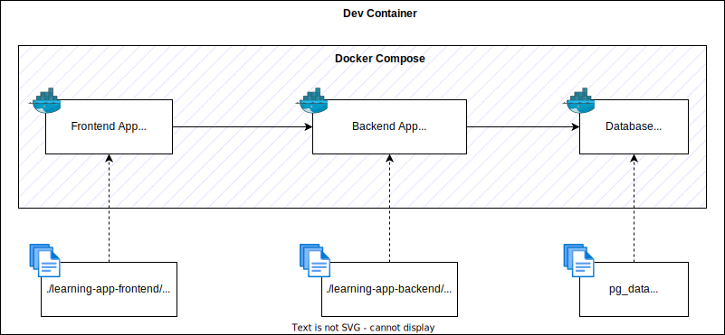

# learning-app

> Work in progress

## Development

This diagram is an overview of the development environment using Docker Compose.



## Start Dev Container

This repository has a development container that has all the required developments tools to aid in development.

- Install docker <https://docs.docker.com/desktop/>
- Start the dev container using Visual Studio Code


## Setup local development configurations

This application uses Firebase for user authentication.

- Follow these instructions to setup a Firebase project: <https://firebase.google.com/docs/web/setup>
- Setup local frontend `.env.local` file

  ```bash
  # Add Firebase Configuration variables
  VITE_APP_FIREBASE_API_KEY
  VITE_APP_FIREBASE_AUTH_DOMAIN
  VITE_APP_FIREBASE_PROJECT_ID
  VITE_APP_FIREBASE_STORAGE_BUCKET
  VITE_APP_FIREBASE_MESSAGING_SENDER_ID
  VITE_APP_FIREBASE_APP_ID
  VITE_APP_FIREBASE_MEASUREMENT_ID

  # Create a configuration for backend API: example http://localhost:8080
  VITE_APP_REACT_APP_API_BASE_URL
  ```

## Start app with Docker Compose

- Set a variable for the development database

  ```bash
  export POSTGRES_PASSWORD="<PASSWORD FOR LOCAL DEV DB GOES HERE>"
  ```

- Start Docker Compose

  ```bash
  docker compose up --build
  ```

- View the application in your browser at <http://localhost:5173>

## Testing

Run tests with the command below.

```bash
npm test
```
